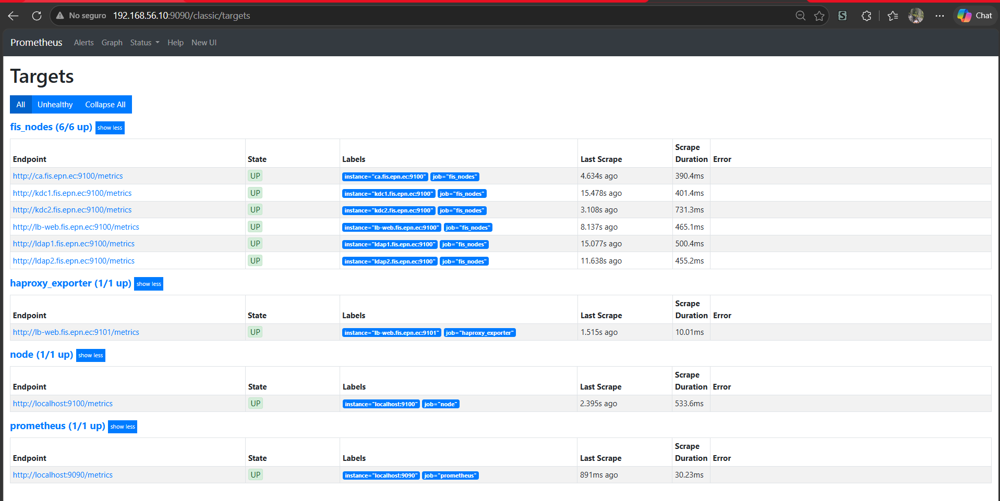

# MiniIdM - Infraestructura de Identidad Segura para la FIS

## Objetivo

Diseñar, implementar y evaluar una infraestructura segura de autenticación y servicios de directorio para la FIS, integrando:

- Autenticación Kerberos (SSO con tickets)
- Infraestructura de Llave Pública (PKI)
- Servicios de Directorio LDAP
- Alta Disponibilidad (HA) en Linux

---

## Arquitectura del Sistema

### Componentes y Distribución

| VM | IP | Rol |
|---|---|---|
| **ca** | 192.168.56.10 | Autoridad Certificadora (PKI) |
| **ldap1** | 192.168.56.11 | Servidor LDAP Maestro |
| **ldap2** | 192.168.56.12 | Servidor LDAP Réplica |
| **kdc1** | 192.168.56.13 | KDC Primario (Kerberos) |
| **kdc2** | 192.168.56.14 | KDC Secundario (Kerberos) |
| **lb-web** | 192.168.56.15 | Balanceador HAProxy + Servicio Web |


---

## Componentes Implementados

### 1. PKI (OpenSSL - ECDSA)
- **CA Raíz**: Autoridad Certificadora para la FIS
- **Certificados**: Emitidos para todos los servidores (LDAP, Kerberos, Web)
- **Algoritmo**: ECDSA con curva `prime256v1`
- **TLS**: LDAPS (puerto 636), HTTPS (puerto 443)

### 2. LDAP (OpenLDAP)
- **Estructura DIT**: `dc=fis,dc=epn,dc=ec`
- **Usuarios**: jperez, malvan, dnoboa, jsaeteros
- **Replicación**: Maestro (`ldap1`) → Réplica (`ldap2`) en tiempo real

### 3. Kerberos (MIT)
- **Realm**: `FIS.EPN.EC`
- **KDC Primario**: `kdc1`
- **KDC Secundario**: `kdc2`
- **Principals**: Usuarios y servicios (LDAP, HTTP)

### 4. Alta Disponibilidad (HA)
- **LDAP**: HAProxy balancea entre `ldap1` y `ldap2`
- **Kerberos**: Failover automático KDC1 → KDC2 (~3.14 segundos)
- **Monitoreo**: Prometheus

### 5. Servicio Web (Apache + SPNEGO)
- **Autenticación**: Kerberos + SPNEGO
- **TLS**: Certificados de la PKI
- **Flujo**: Browser → Ticket Kerberos → Web Service

### 6. Monitoreo (Prometheus)
- **Node Exporter**: En todas las VMs
- **Métricas**: CPU, Memoria, Disco, Red
- **Targets**: 6/6 UP

---

## Pruebas de Alta Disponibilidad

| Experimento | Resultado | Tiempo de Recuperación |
|---|---|---|
| Crash de ldap1 (kill -9) | ✅ Failover a ldap2 | ~2-3s |
| Partición de red (iptables) | ✅ Failover a ldap2 | ~2-3s |
| Certificado expirado | ❌ Conexión rechazada | N/A |
| Fallo de KDC1 | ✅ Failover a KDC2 | ~3.14s |

**Tasa de autenticaciones exitosas:** 100%

---

## Tecnologías Utilizadas

| Componente | Tecnología | Versión |
|---|---|---|
| LDAP | OpenLDAP | 2.6.10 |
| Kerberos | MIT Kerberos | 1.22.1 |
| PKI | OpenSSL | 3.x |
| Balanceo | HAProxy | 3.2.9 |
| Servicio Web | Apache + mod_auth_gssapi | 2.4 |
| Monitoreo | Prometheus | 2.53.5 |
| SO | Ubuntu Server | 26.04 LTS |

---


## Requisitos Previos

- VirtualBox con 6 VMs Ubuntu Server 26.04 LTS
- Red Interna: 192.168.56.0/24
- SSH habilitado en todas las VMs

---

## Instalación Rápida

```bash
# Clonar el repositorio
git clone https://github.com/JASL22/SaeterosJ-MiniIdM.git
cd SaeterosJ-MiniIdM

# Ejecutar Makefile
make all

---

## Prometheus Targets:
http://192.168.56.10:9090/classic/targets

